## 0.背景

距离上一次使用 Debian Server 构建路由器的时间已经过去了近半年时间。  

随着家庭宽带步了入千兆互联时代， IPv6 也得到了进一步的普及，而上一版 Linux Router 的折腾方式已不能满足当前的使用需求。  

因此决定重新折腾一个支持 IPv6 的 Linux Router，并修复上版中存在的设置缺陷。  

根据这段时间对 Linux 的进一步学习，结合我在某云厂工作期间积累的知识，本次 Linux Router 构建过程中涉及的核心组件包括：

- 网口以及网桥设置：`systemd-networkd`
- PPPoE 拨号：`pppoe` 、 `systemd-networkd`
- DHCP 以及 DNS ：`dnsmasq`
- 防火墙：`nftables`
- 系统自动更新：`unattended-upgrades`

由于使用了 `systemd`，因此本系列文章主要适用于支持 `systemd` 的 Linux 发行版。  

当然，如果使用了其他方法来设置网口、网桥以及 PPPoE 自动拨号，即可绕开 `systemd` 的约束。  

原本计划使用 `dhcpcd` 来完成服务器 IPv6 配置，但在实际测试中发现，仅使用 `systemd` 即可完成 IPv6 配置。  

由于受到 `systemd` 版本限制，各 Linux 发行版要求如下：

- Debian 12
- Ubuntu Server 22.10
- Alpine Linux
- Archlinux（资深玩家首选）

这次选择 Ubuntu 22.10 的 Server 版本作为设置对象，一边体验一下 Ubuntu，一边等待 Debian 系统的大版本升级。

## 1.前期准备

Ubuntu Server 既可以直接安装在物理设备上，也能在虚拟化环境中良好运行，本系列文章主要在 PVE 环境下进行安装设置。  

PVE 的安装与设置方法参考我的系列文章[《Proxmox VE 折腾手记》](https://gitee.com/callmer/pve_toss_notes)。  

需要一台已连接外网的路由设备，用于给 Ubuntu Server 在初始化阶段提供网络。  

访问 Ubuntu 的发布页面 [Ubuntu Release](https://releases.ubuntu.com) 下载 Ubuntu 22.10 Server 版安装 ISO 文件，并一同下载 ISO 的校验文件。

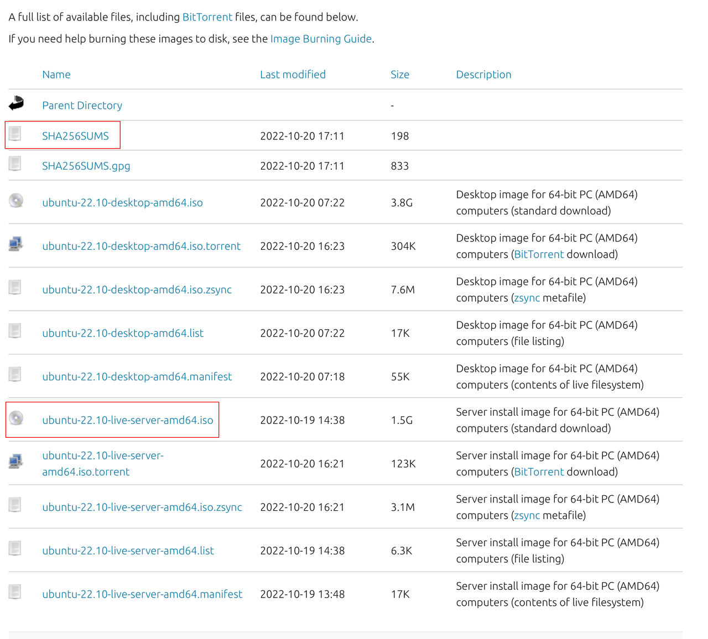

## 2.创建 Linux 虚拟机

登录 PVE 管理后台，将 Ubuntu Server 的 ISO 文件上传到 PVE 服务器。  

进入新建虚拟机流程，并打开高级选项。  

### 2.1.常规

节点即本机，`VM ID` 和 `名称` 可自定义。  

`启动/关机顺序` 以及 `启动延时` 相关参数可以根据实际需要进行调整。  

`关机超时` 参数一般无需填写，此处设为 `30` 仅供测试使用。

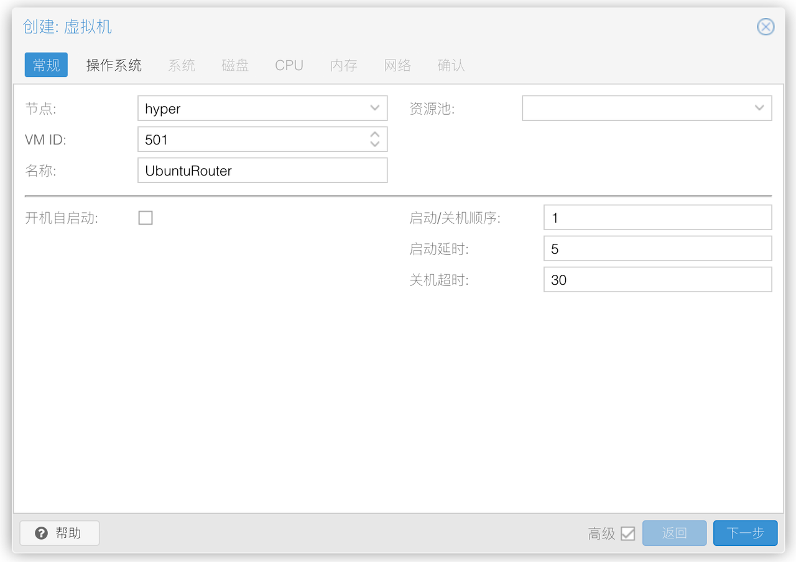

### 2.2.操作系统

使用的光盘镜像文件选择刚才上传的 Ubuntu Server ISO 文件。  

操作系统类别选择 `Linux` 、内核版本 `5.x - 2.6 Kernel` 即可。

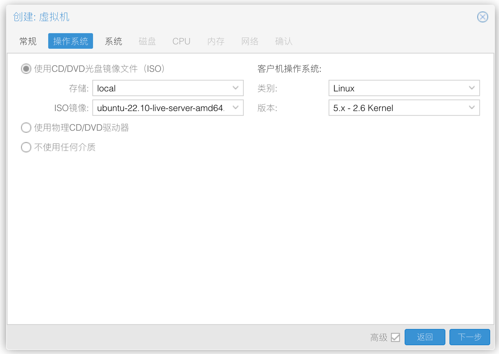

### 2.3.系统

系统部分需要修改几项参数。  

显卡选择 `默认` ，SCSI 控制器选择 `VirtIO SCSI single` 。  

机型可选择 `q35` ，对 `PCIE设备` 的直通会有更好的支持。  

后续将会在 Ubuntu Server 系统中安装 `Qemu Agent` ，因此建议勾选 `Qemu代理` 选项。  

BIOS 可选 `默认(SeaBIOS)` ，也可选 `OVMF(UEFI)` ，可根据实际需求进行调整。

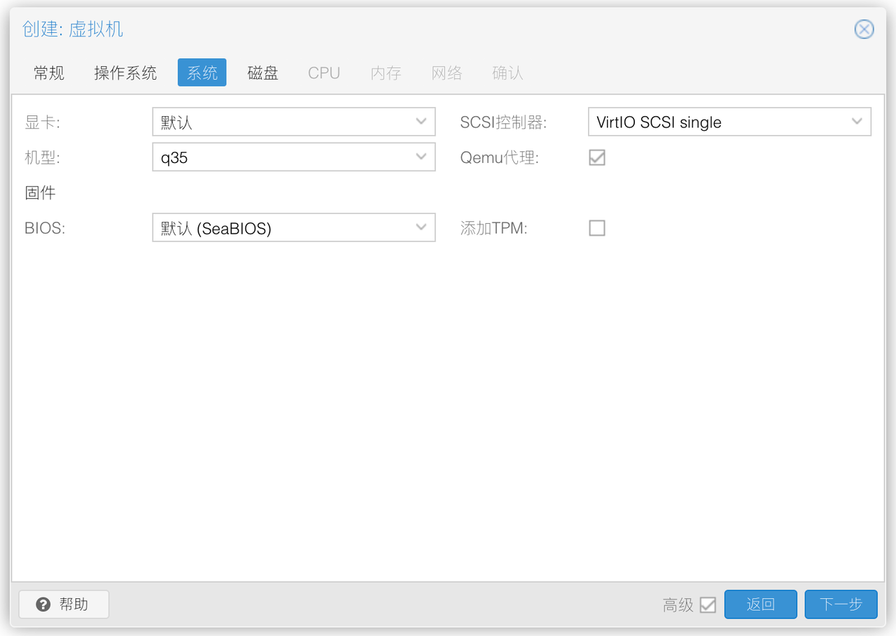

### 2.4.磁盘

根据 PVE 服务器的硬盘资源情况酌情分配 Ubuntu Server 的硬盘容量。  

建议硬盘分配容量不要低于 20 GiB 。  

勾选 `IO thread` 选项，与当前的 SCSI 控制器搭配使用。  

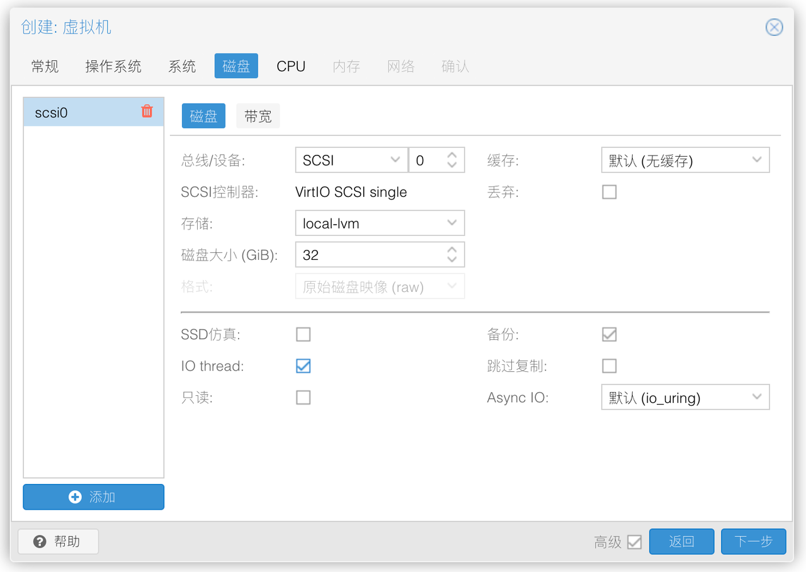

### 2.5.CPU

根据 PVE 服务器的 CPU 资源情况酌情分配 Ubuntu Server 的 CPU 资源。  

CPU类别选择 `host` ，核心数建议不要少于 `2` ，具体数值需要根据 CPU 性能以及设备 CPU 物理核心数来综合考虑。  

J4125 CPU 在分配 `2` 核心的情况下，可基本满足千兆外网的使用需求，以供参考。  

由于测试环境中虚拟机较多，CPU 的超分（over-commit）比较严重，因此我加大了本虚拟机的 `CPU权重` ，演示值为 `2048` ，让本虚拟机可获得相较于其他虚拟机更多的 CPU 时间。  

若 PVE 服务器内有多颗物理 CPU ，则推荐启用 `NUMA` ：

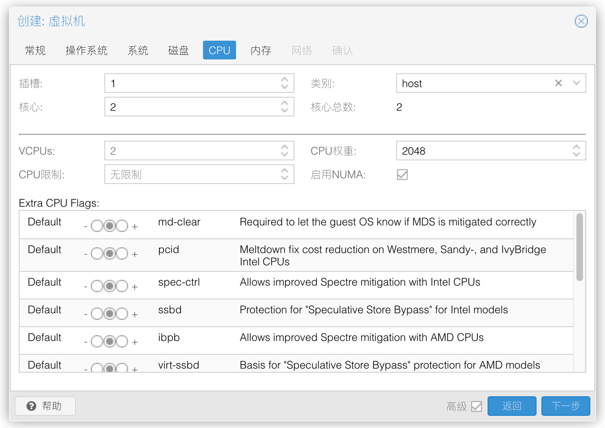

### 2.6.内存

内存一般 `2G` 足够使用，关闭 `Ballooning设备` 选项。  

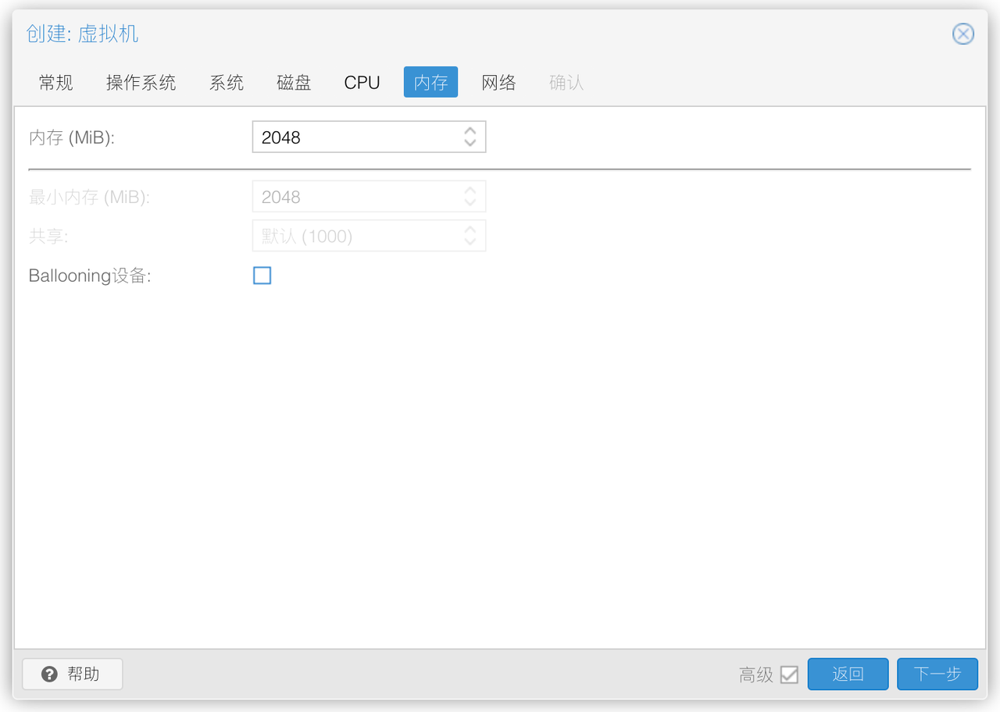

### 2.7.网络

需要注意，此页设置只能添加一个网络设备，而网络设备的添加顺序将和 Ubuntu Server 内部显示的网卡顺序一致。  

因此我们此处先仅添加 WAN 对应的网口（此处为 `vmbr0` ），模型选择 `VirtIO` ，并取消勾选防火墙选项。  

对于使用硬件直通的小伙伴，可以根据实际情况来修改此处网络设备选项。  

推荐在 `Multiqueue` 处根据前面设置的 CPU 数量进行网卡多队列设置，设置比例为 1:1 。  

即有 n 个 CPU 核心，此处多队列也设置为 n 。  

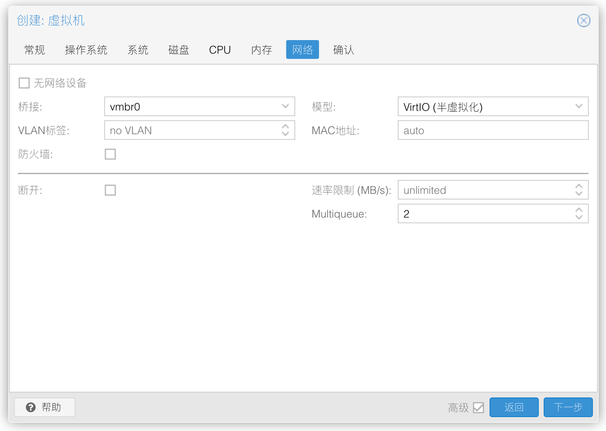

### 2.8.确认

接下来查看设置总览，确认无误，即可点击 “完成” 。

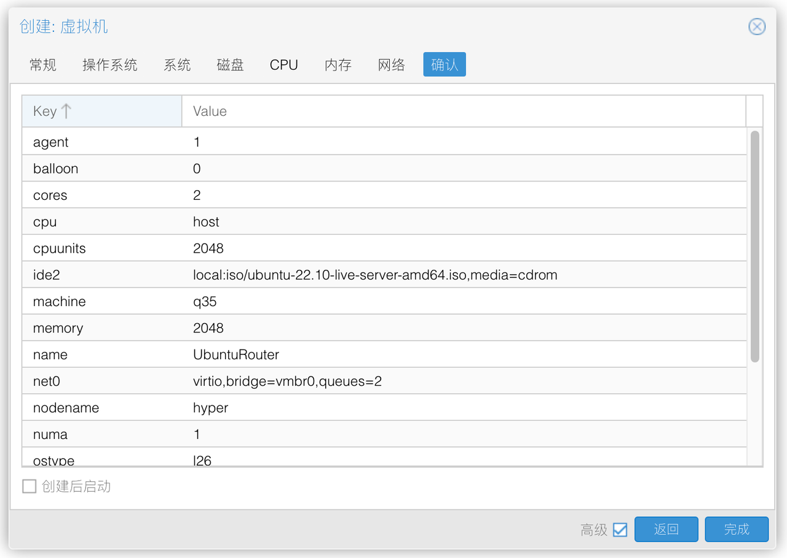

## 3.调整虚拟机硬件参数

此时，查看虚拟机详情页，可以看到我们刚才创建的虚拟机。

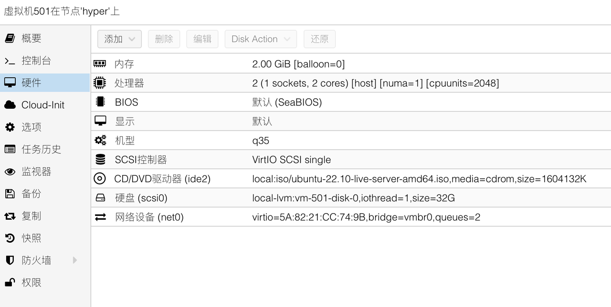

根据实际情况，开始添加需要的网络设备。

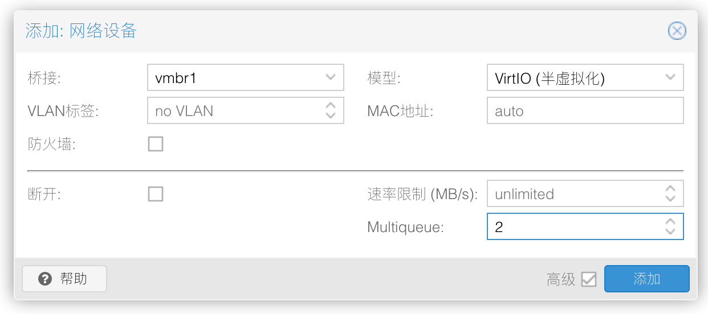

所有网络设备去掉防火墙，并增加网卡多队列选项。示例如下：

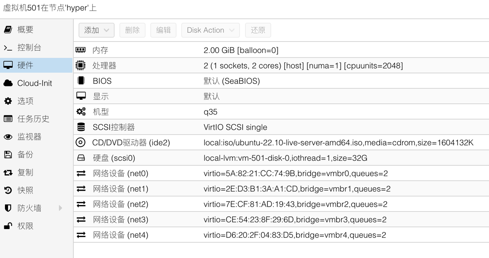

 **注意：**   

经过实际测试，如果此处添加了 **直通网卡** ，在实际使用过程中，尽量 **不要** 在短时间内让大流量穿过不同种类的网卡；  

以避免因过高的系统中断而引起的网络性能降低。  

例如：  
  
虚拟机有3个网络设备，分别为直通网卡A、直通网卡B、VirtIO桥接网卡C；  

网卡A作为WAN口使用，网卡B和C进行桥接作为LAN口使用；  

如果千兆流量流经网卡A与网卡C，则虚拟机的系统中断将会陡增；  

CPU出现单个核心跑满的现象，网络NAT性能将会受到严重影响；   

此时，如果让流量流经网卡A与网卡B，则可以避免这个现象的产生。  

## 4.调整虚拟机配置参数

初创的 Ubuntu Server 的配置参数如下：

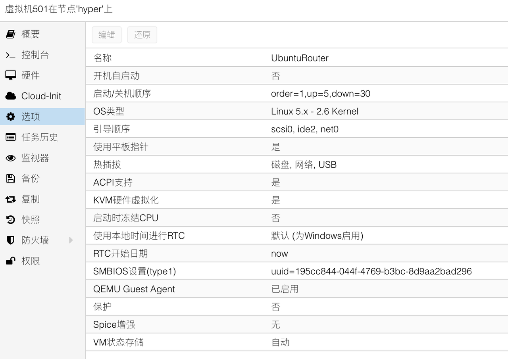  

调整虚拟机的 `引导顺序` 选项，建议移除网络启动相关的 `net0` 引导项。  

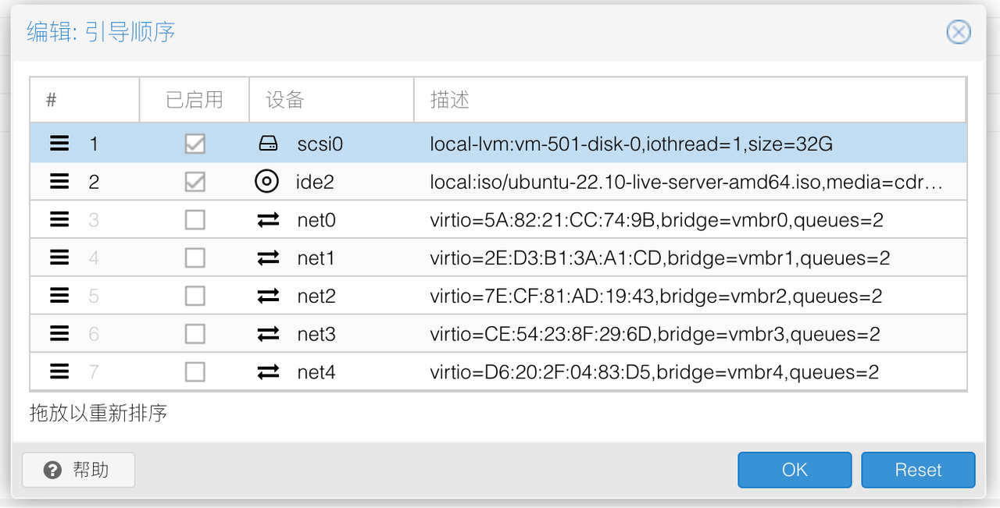

然后 `关闭` 虚拟机的 `使用平板指针` 选项，可以一定程度上降低虚拟机的 CPU 使用率。  

  

修改完成后，总体情况如图所示，等待 Ubuntu Server 完全设置好，运行无异常之后，即可开启该虚拟机的 `开机自启动` 设置。  

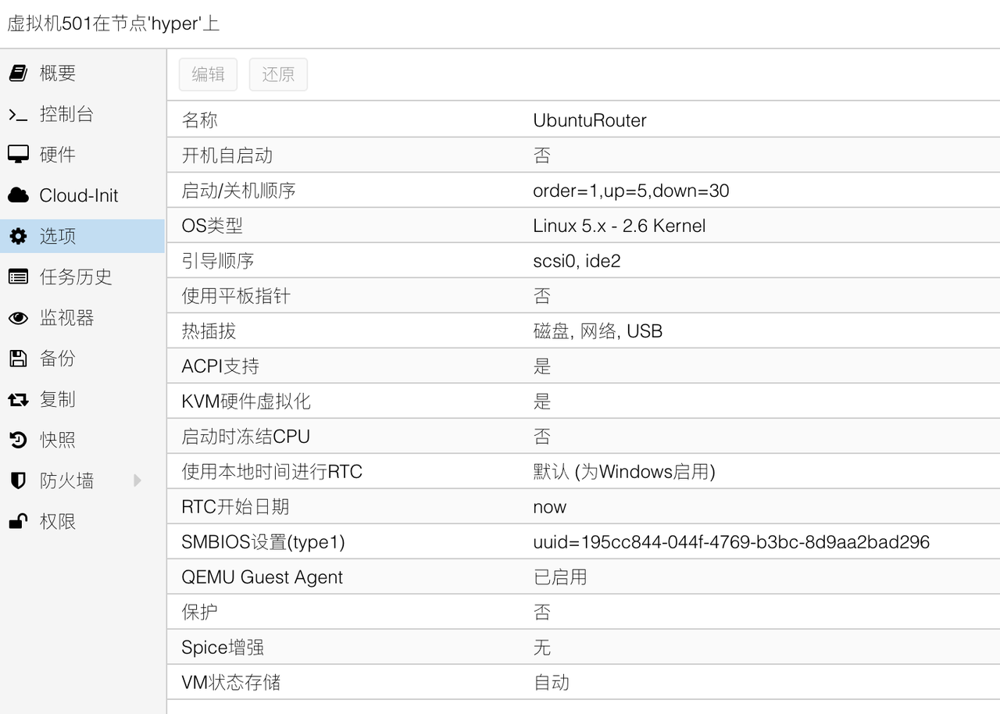

## 5.虚拟机开机

切换到虚拟机的 “控制台” 选项卡，让虚拟机开机。  

此处需要注意的是，目前 Ubuntu Server 并未设置，因此不会对网络造成什么影响，但是如果后续 Ubuntu Server 设置了内部网桥，且此时 PVE 服务器内有其他的路由系统（例如 Openwrt）也在相同的网络接口上有网桥，就会引起网络环路导致网络无法访问。  

选择第一项，并使用回车键 `Enter` ，即可开始安装。  

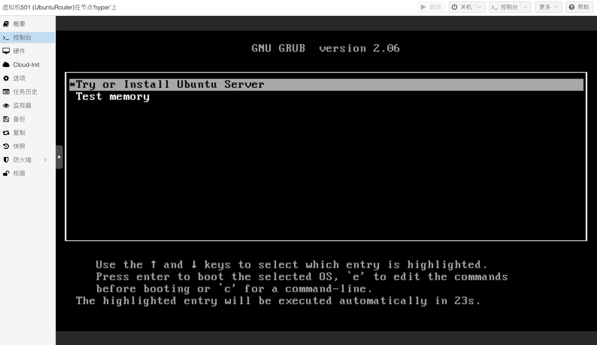

至此，Ubuntu Server 虚拟机创建步骤完成。
