## 1.安装Ubuntu服务器

在上一篇文章[《00.Ubuntu_PVE创建服务器》](./00.Ubuntu_PVE创建服务器.md)中，已经创建了 Ubuntu Server 的虚拟机，现在开始安装操作系统。

### 1.1.系统语言

等待 Ubuntu Server 自检跑码完成，进入安装选项界面。  

首先需要选择 Ubuntu Server 使用的系统语言。  

为了避免后续系统组件在系统语言上遇到问题，建议系统语言保持默认的 `English` 。

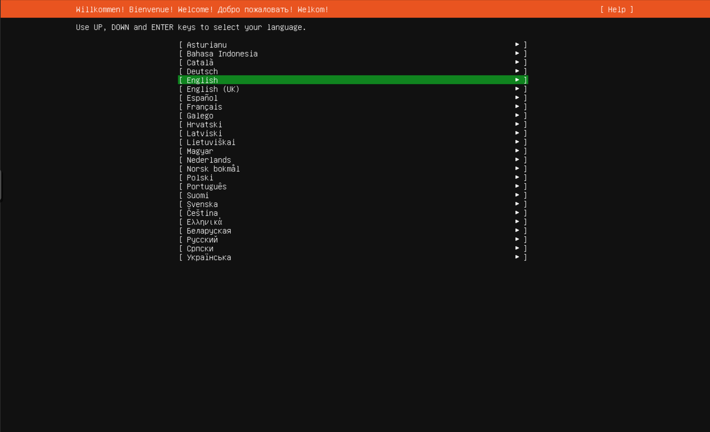

### 1.2.键盘布局

系统键盘布局建议保持默认的 `English (US)` 。  

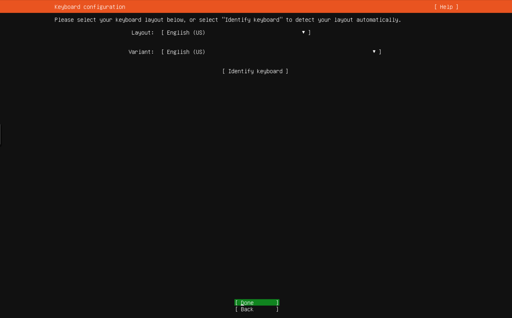

### 1.3.安装模式

Ubuntu Server 的安装模式有 `Ubuntu Server` 和 `Ubuntu Server (minimized)` 两种选项。  

如果选用 `Ubuntu Server (minimized)` “最小化” 安装模式，则系统会提示：

> This system has been minimized by removing packages and content that are not required on a system that users do not log into.  
> To restore this content, you can run the 'unminimize' command.  

系统 “最小化” 安装后，连文本编辑器 `nano` 工具也需要额外安装。  

因此，如无特别需求，建议使用普通的安装模式。 

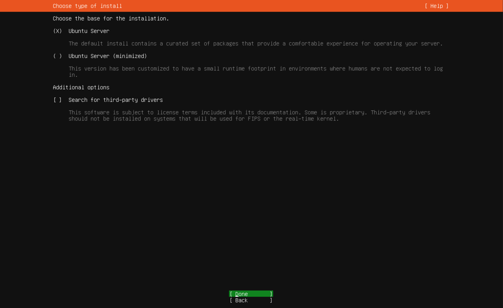 

### 1.4.网络接口

由于我在 PVE 环境下安装，因此有 4 个网口均获取了内网的 IP 地址。  

如果使用其他路由器设备提供网络，此处将只有与上级路由器互联的网口会获取 IP 地址。  

为了避免干扰，我选择保留最后一个网口的 IP 地址，并将其他网口的 DHCP 客户端禁用。  

打开网口 IPv4 的编辑选项：  

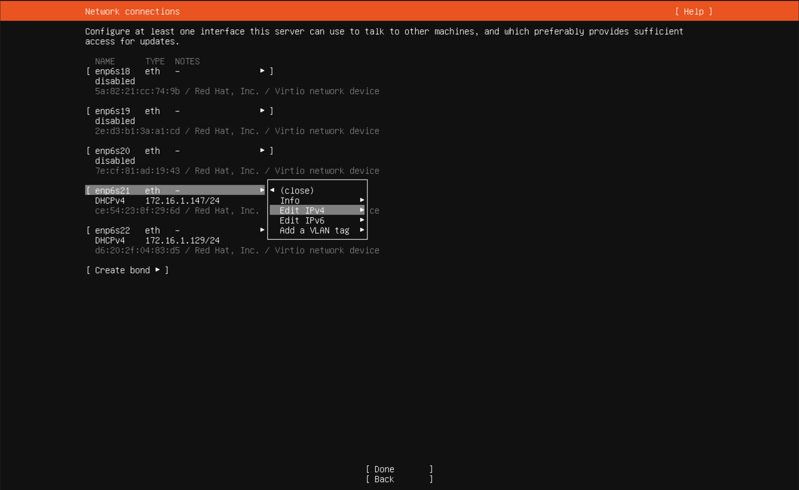

将网口 IPv4 设置方式设为 `Disabled` 即可：  

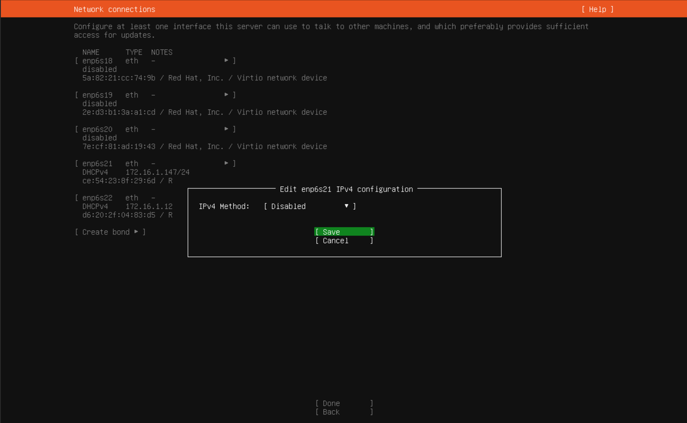

各个网口设置完成后，如图所示，确认无误后即可进行下一步操作。


### 1.5.网络代理

网络代理地址 `Proxy address` 一般无需填写。

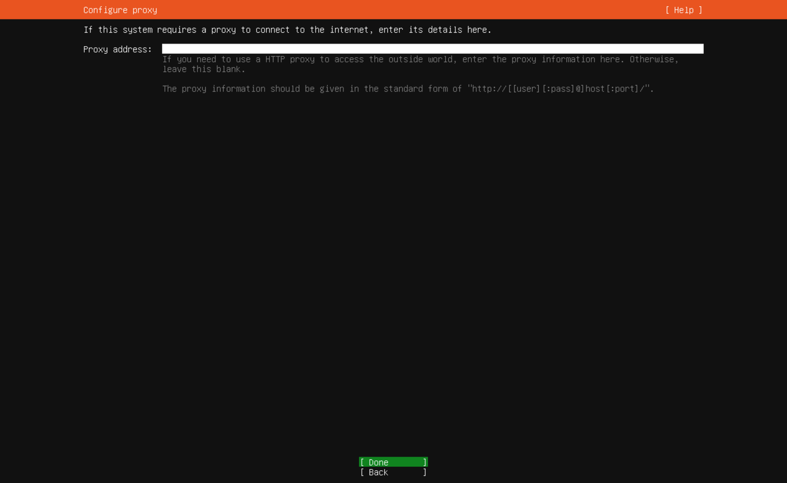  

### 1.6.系统镜像站

Ubuntu Server 在安装期间可以通过此处设置的 `Mirror address` 进行软件包更新。  

其作用是让系统在安装完成时，所有的软件包均为最新。  

为了保证软件包下载速度，建议将 `Mirror address` 设置为国内的镜像站地址，这里使用 USTC 的镜像站作为演示。  

需要说明的是，此处设置的 `Mirror address` 仅作临时使用，在系统安装完成后，将进一步修改。

```txt
## 国内 USTC 的 Ubuntu 镜像站
https://mirrors.ustc.edu.cn/ubuntu
```


### 1.7.磁盘布局

默认情况下 Ubuntu Server 会使用 `LVM` ，方便起见，我这里去掉了使用 `LVM` 的选项。

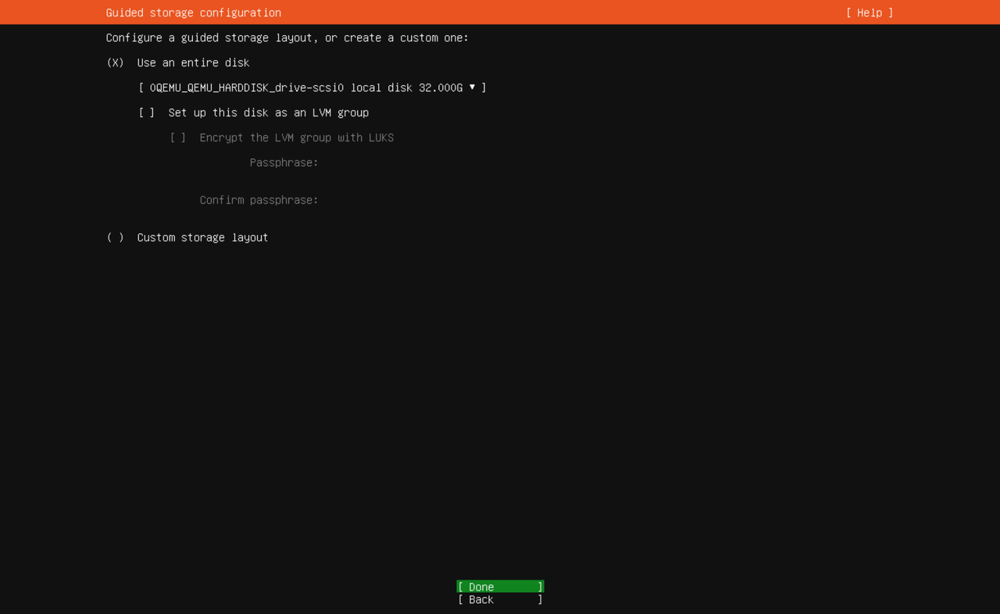

### 1.8.磁盘分区

默认情况下 Ubuntu Server 会使用 `ext4` 文件系统，我比较推荐使用 `xfs` 文件系统。  

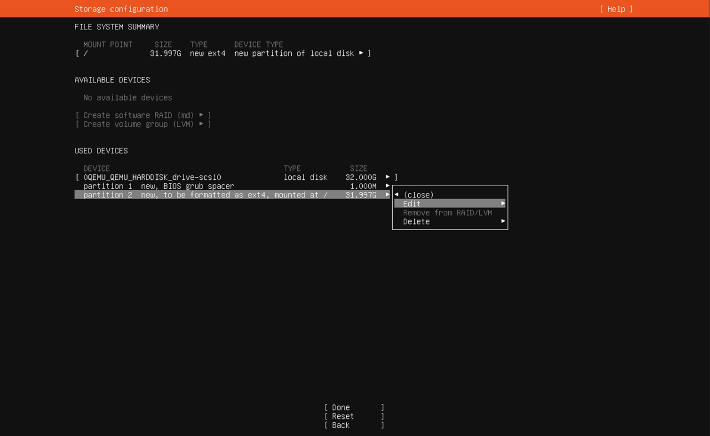

将文件系统设置为 `xfs` ：

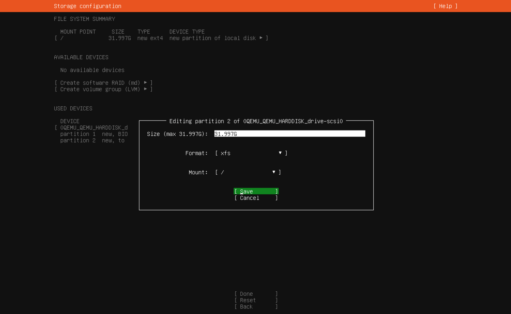

检查硬盘分区信息，确认无误后，即可进入下一步。

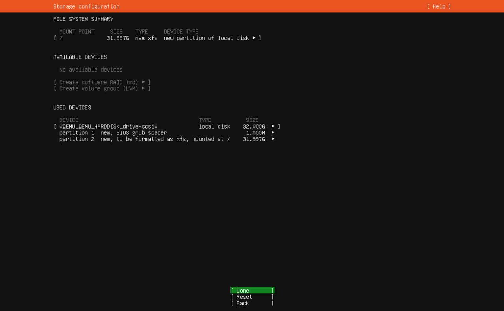

系统将会询问是否将分区信息写入硬盘，选择 `Continue` 确认：  

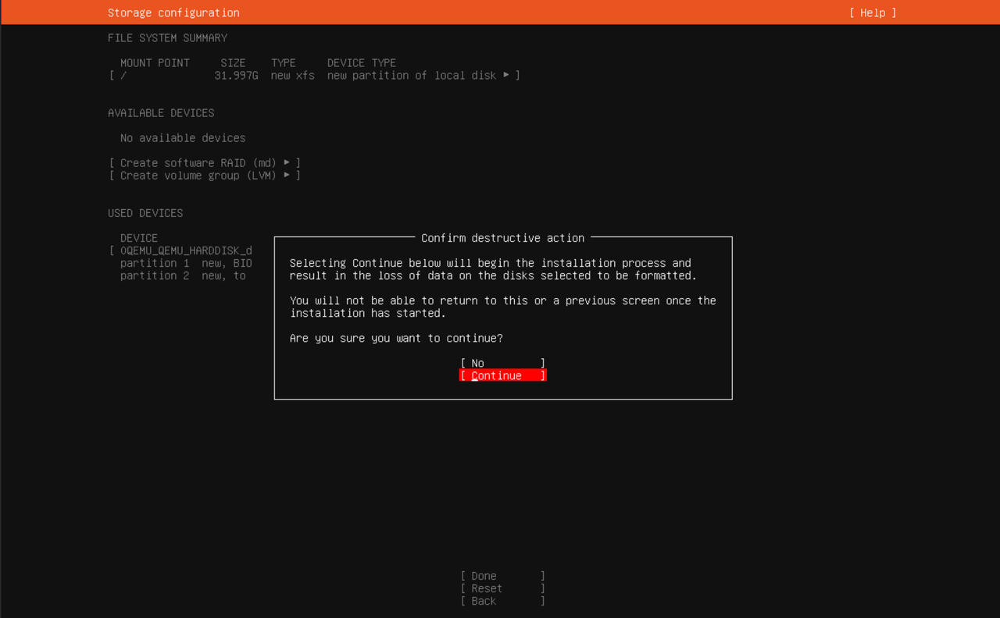

### 1.9.系统账户

Ubuntu 系统均未提供 `root` 账户的密码登录选项。  

此处创建的用户默认具有 `sudo` 命令的使用权限。  

由于该系统将作为路由器使用，建议使用强密码。

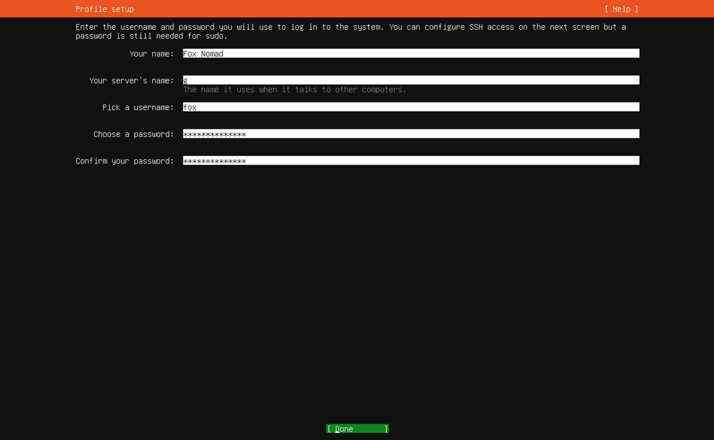

### 1.10.OpenSSH服务

必须勾选 `Install OpenSSH server` 选项，方便后续使用 `ssh` 命令访问服务器。  

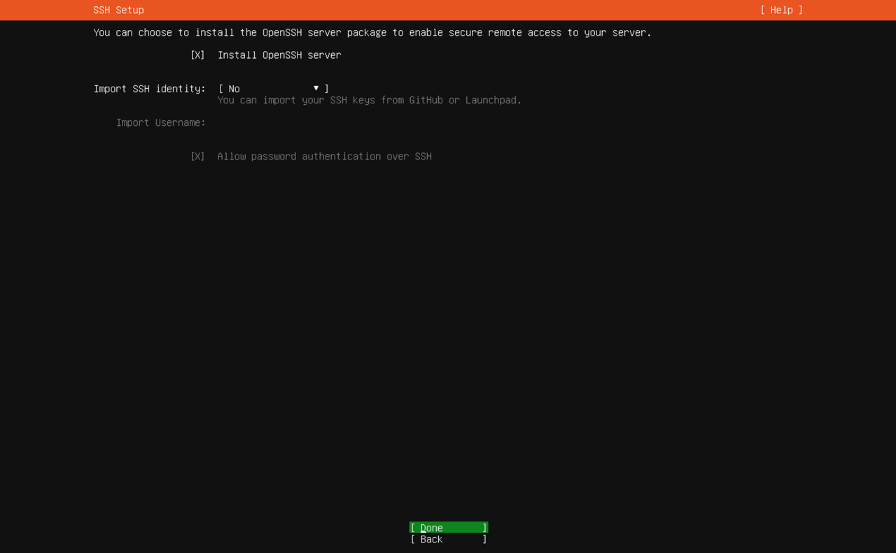

### 1.11.附加组件

在系统安装阶段无需额外安装列表中的组件。

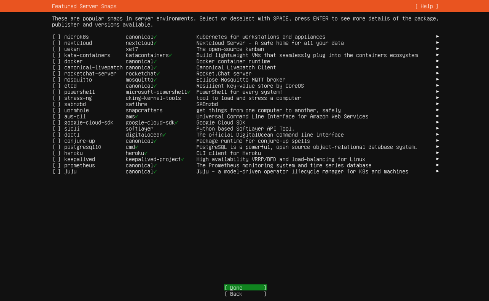

### 1.12.系统安装

系统开始正式安装，可以通过下方的 `View full log` 选项查看实时安装日志。

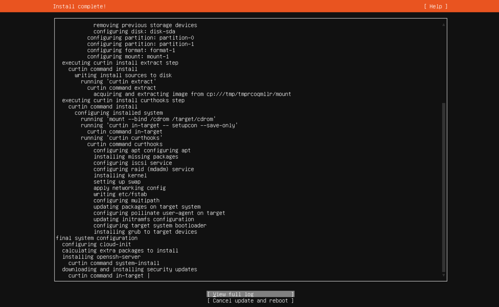

系统安装完成后，选择 `Reboot Now` 选项将系统重启。


如果在重启系统过程中，系统提示如图所示信息，表示无法自动弹出系统安装 ISO 。  

只需按下键盘回车键 `Enter` 即可完成重启。  

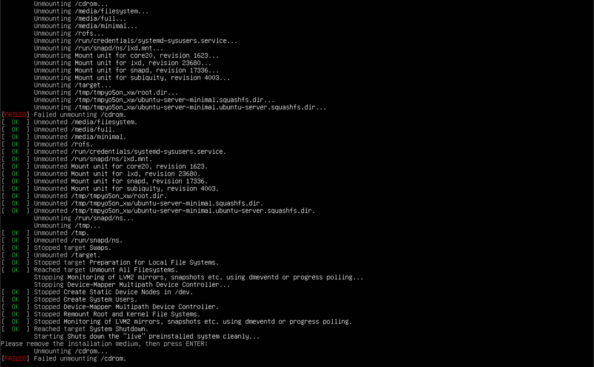  

## 2.查看服务器 IP 地址

由于系统重启后，再次获取的 IPv4 地址可能发生变化，因此需要再次确认当前的 IPv4 地址。  

等待系统重启完成，在 `控制台` 中再次登录 Ubuntu Server 。  


可以查看当前服务器的 `IP` 地址，需要将该地址记录下来，后续将会使用到。  

如果因为某些原因此处并未显示 `IP` 地址，需要使用命令查看网卡 `IP` 地址信息。  

```bash
## 查看系统 IPv4 地址
ip a
```


至此，Ubuntu 服务器系统安装步骤完成。
