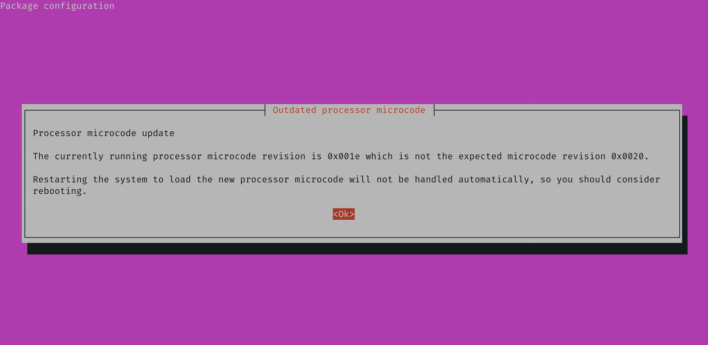
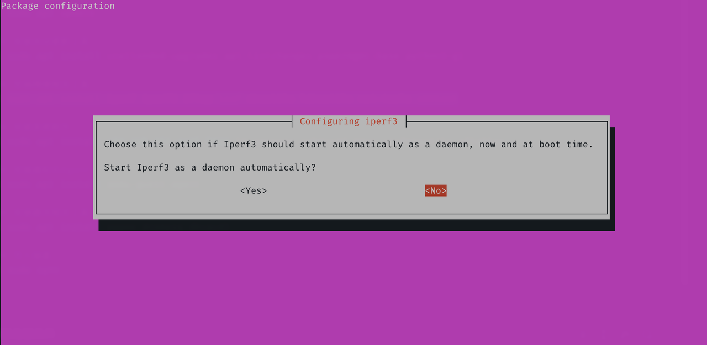

## 1.配置软件源

在上一篇文章 [01.Ubuntu_安装操作系统](./01.Ubuntu_安装操作系统.md) 中，已经安装好了 Ubuntu Server，并获取了其 IPv4 地址。  

使用终端工具登录 Ubuntu Server，常用终端工具可以看之前文章中的 [终端工具推荐](https://gitee.com/callmer/pve_toss_notes/blob/master/01.PVE系统安装.md) 。  

由于之前设置的 `Mirror address` 仅为临时使用地址，现在需将其修改为完整版，依然使用 USTC 镜像站作为演示。  

以后，当系统版本发生变化时，请参考 USTC 镜像站的官方说明 [USTC Mirror Help - Ubuntu](https://mirrors.ustc.edu.cn/help/ubuntu.html) 。  

如果系统安装模式为 `Ubuntu Server (minimized)` ，则在修改系统软件源之前，务必安装以下软件包。  

```bash
## 安装文本编辑器
$ sudo apt install nano neovim
```

Ubuntu 24.04 的软件源配置采用了 `DEB822` 格式，新版 `sources.list` 配置文件内容如下。  

```bash
## 查看镜像配置文件
$ cat /etc/apt/sources.list

#### 配置文件示例输出
# Ubuntu sources have moved to /etc/apt/sources.list.d/ubuntu.sources
```

使用 `neovim` 编辑器编辑 `ubuntu.sources` 配置文件，执行以下命令。  

```bash
## 编辑 ubuntu.sources 配置文件
$ sudo nvim /etc/apt/sources.list.d/ubuntu.sources
```

删除里面全部内容，添加以下配置项，并保存。  

```bash
## 系统软件源配置项

Types: deb
URIs: https://mirrors.ustc.edu.cn/ubuntu
Suites: noble noble-updates noble-backports
Components: main restricted universe multiverse
Signed-By: /usr/share/keyrings/ubuntu-archive-keyring.gpg

Types: deb
URIs: https://mirrors.ustc.edu.cn/ubuntu
Suites: noble-security
Components: main restricted universe multiverse
Signed-By: /usr/share/keyrings/ubuntu-archive-keyring.gpg

```

## 2.更新系统

同步软件源并更新系统，执行以下命令。  

```bash
## 清理软件包
$ sudo bash -c 'apt clean && apt autoclean && apt autoremove --purge'

## 同步软件源
$ sudo apt update

## 更新系统
$ sudo apt full-upgrade
```

## 3.安装系统软件

接下来安装配置 Ubuntu Server 的必要软件，执行以下命令。  

```bash
## 安装系统软件
$ sudo apt install bash-completion whiptail nano curl btop tmux logrotate cron neovim zsh git

## 安装系统自动更新工具
$ sudo apt install unattended-upgrades powermgmt-base python3-gi

## 安装路由器相关软件
$ sudo apt install pppoe dnsmasq conntrack nftables sshguard lsof knot-dnsutils iputils-ping

## 安装网络检测工具（可选）
$ sudo apt install iftop iperf3 iperf

## 更新 PCI 数据库
$ sudo update-pciids

## 写入磁盘
$ sudo sync
```

当 Ubuntu Server 作为虚拟服务器运行时，需要安装 `Qemu Agent` 。  

```bash
## 安装 Qemu Agent
$ sudo apt install qemu-guest-agent
```  

当 Ubuntu Server 作为物理服务器运行时，可考虑额外安装以下软件。  

```bash
## 安装系统软件
$ sudo apt install lm-sensors smartmontools ethtool

## 安装 Linux 工具包（包含 CPU 调度调整工具）
$ sudo apt install linux-tools-generic

## 根据 CPU 厂商安装 CPU 微码工具
$ sudo apt install intel-microcode (amd64-microcode)
```

在软件安装过程中，系统可能会提示如下信息，表示系统识别到当前 CPU 微码需要更新。  

但在 PVE 环境下，Ubuntu Server 无法加载最新的 CPU 微码，因此可安全忽略该警告。  



如果遇到询问是否将 `iperf3` 作为系统服务项自动启动，一般选择 `No` 即可。  



## 4.配置 ZSH

`Zsh` 是比 `Bash` 好用的 `Shell` 程序，使用 `oh-my-zsh` 进行配置。  

```bash
## 使用清华大学镜像站安装 oh-my-zsh
$ cd && git clone --depth=1 https://mirrors.tuna.tsinghua.edu.cn/git/ohmyzsh.git

$ cd ohmyzsh/tools && REMOTE=https://mirrors.tuna.tsinghua.edu.cn/git/ohmyzsh.git sh install.sh

## 询问是否切换默认 shell，输入 Y

#### 示例输出
Time to change your default shell to zsh:
Do you want to change your default shell to zsh? [Y/n] y

## oh-my-zsh 安装后清理
$ cd && rm -rvf ohmyzsh .bash_history .zsh_history .shell.pre-oh-my-zsh
```

至此，Ubuntu 服务器安装系统软件步骤完成。  
