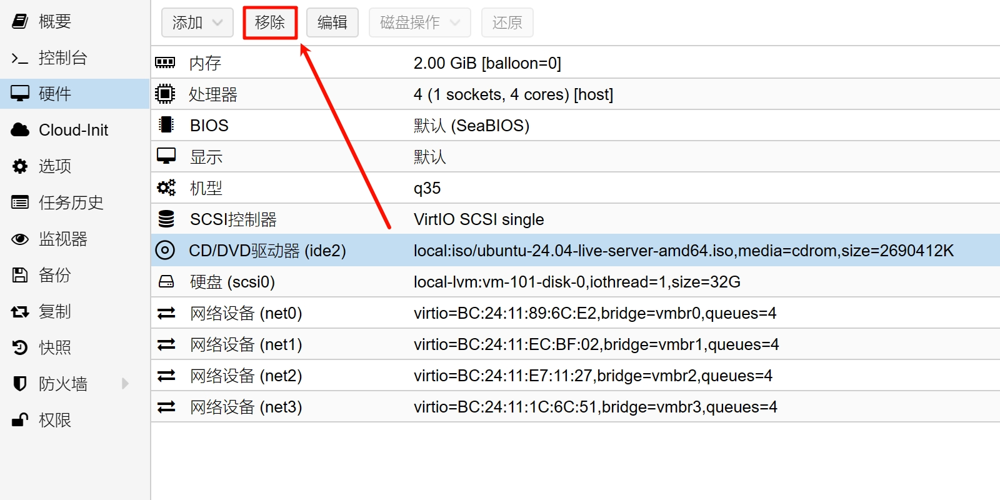
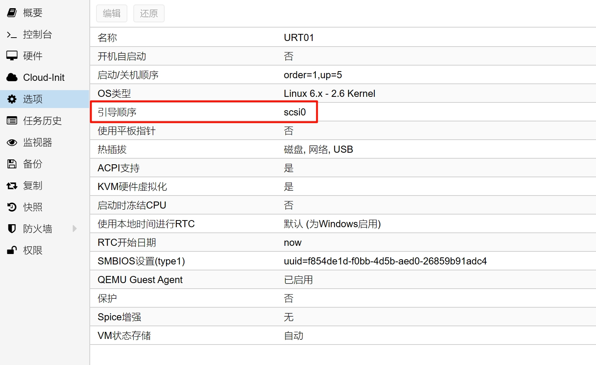
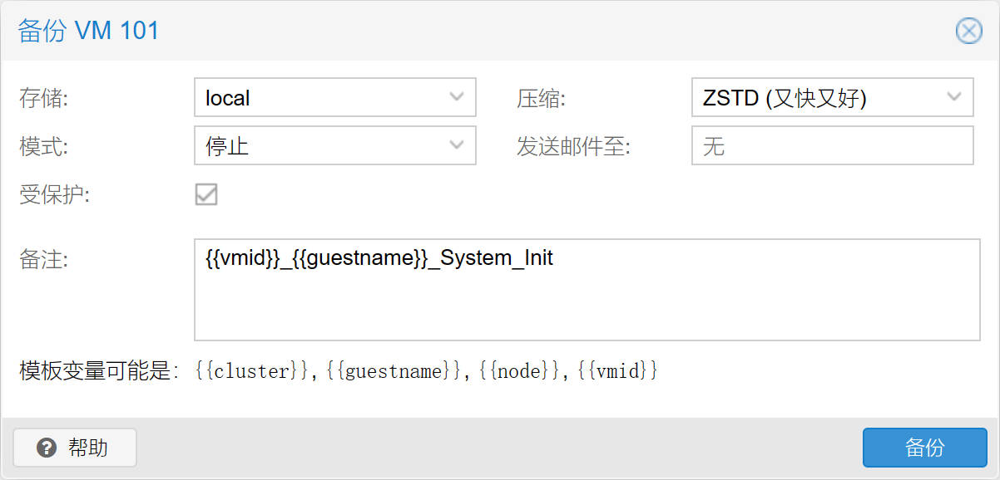

## 1.系统时间

在上一篇文章 [02.Ubuntu_安装系统软件](./02.Ubuntu_安装系统软件.md) 中，已经安装了必要软件，现在开始配置系统基础参数。  

默认情况下 Ubuntu Server 的系统时间需要调整，执行以下命令将系统时区设置为中国时区。  

```bash
## 设置系统时区
$ sudo timedatectl set-timezone Asia/Shanghai

## 检查系统时间
$ date -R

#### 系统时间示例输出
Mon, 26 Jun 2023 16:16:16 +0800
```

Ubuntu Server 默认使用 `systemd-timesyncd.service` 同步时间，且需要调整为使用国内 NTP 服务器。  

调整 NTP 服务器参数，执行以下命令。  

```bash
## 创建 NTP 配置目录
$ sudo mkdir -p /etc/systemd/timesyncd.conf.d

## 创建 NTP 配置文件
$ sudo nvim /etc/systemd/timesyncd.conf.d/10-server-ntp.conf
```

在配置文件中添加以下配置项，并保存。  

```bash
# This configuration file is customized by fox,
# Optimize system NTP server.

[Time]
NTP=ntp.aliyun.com ntp.tencent.com cn.pool.ntp.org

```

## 2.系统自动更新

配置 Ubuntu 服务器的系统自动更新，与配置 Debian 系统自动更新方法基本一致，参阅 [PVE 制作虚拟机模板](https://gitee.com/callmer/pve_toss_notes/blob/master/05.PVE制作虚拟机模板.md) 。  

## 3.系统内核模块

本段内核模块设置主要针对 `nftables` 的一些必要特性进行设置。  

使用 `neovim` 编辑器创建 **内核模块** 配置文件，执行以下命令。  

```bash
## 创建 内核模块 配置文件
$ sudo nvim /etc/modules-load.d/10-server-modules.conf
```

在配置文件中添加以下配置项，并保存。  

```bash
# This configuration file is customized by fox,
# Optimize netfilter related modules at system boot.

nf_conntrack

```

## 4.系统内核参数

为了能让服务器完成路由器功能，需要对内核参数进行调整。  

使用 `neovim` 编辑器编辑 **内核参数** 配置文件，执行以下命令。  

```bash
## 编辑 内核参数 配置文件
$ sudo nvim /etc/sysctl.d/99-sysctl.conf
```

在配置文件中添加以下配置项，注意配置中间的空格。  

```bash
# This configuration file is customized by fox,
# Optimize sysctl parameters for Linux Router.

kernel.panic = 20
kernel.panic_on_oops = 1

net.core.default_qdisc = fq_codel
net.ipv4.tcp_congestion_control = bbr

net.ipv4.ip_forward = 1

net.ipv6.conf.all.forwarding = 1
net.ipv6.conf.default.forwarding = 1

# Other adjustable system parameters

net.core.netdev_budget = 600
net.core.netdev_budget_usecs = 20000

net.core.rps_sock_flow_entries = 32768
net.core.somaxconn = 8192
net.core.rmem_max = 26214400
net.core.wmem_max = 655360

net.ipv4.conf.all.accept_redirects = 0
net.ipv4.conf.default.accept_redirects = 0

net.ipv4.conf.all.accept_source_route = 0
net.ipv4.conf.default.accept_source_route = 0

net.ipv4.conf.all.arp_ignore = 1
net.ipv4.conf.default.arp_ignore = 1

net.ipv4.conf.all.rp_filter = 2
net.ipv4.conf.default.rp_filter = 2

net.ipv4.conf.all.send_redirects = 0
net.ipv4.conf.default.send_redirects = 0

net.ipv4.igmp_max_memberships = 256

net.ipv4.route.error_burst = 500
net.ipv4.route.error_cost = 100

net.ipv4.route.redirect_load = 2
net.ipv4.route.redirect_silence = 2048

net.ipv4.tcp_adv_win_scale = -2
net.ipv4.tcp_challenge_ack_limit = 1000
net.ipv4.tcp_fastopen = 3
net.ipv4.tcp_fin_timeout = 30
net.ipv4.tcp_keepalive_time = 120
net.ipv4.tcp_max_syn_backlog = 512
net.ipv4.tcp_notsent_lowat = 131072
net.ipv4.tcp_rmem = 8192 262144 536870912
net.ipv4.tcp_wmem = 4096 16384 536870912

net.ipv6.conf.all.accept_ra = 0
net.ipv6.conf.default.accept_ra = 0

net.ipv6.conf.all.accept_redirects = 0
net.ipv6.conf.default.accept_redirects = 0

net.ipv6.conf.all.accept_source_route = 0
net.ipv6.conf.default.accept_source_route = 0

net.ipv6.conf.all.use_tempaddr = 0
net.ipv6.conf.default.use_tempaddr = 0

net.netfilter.nf_conntrack_acct = 1
net.netfilter.nf_conntrack_tcp_timeout_established = 7440

```

保存该配置文件后，重启系统或者执行以下命令让配置生效。  

```bash
## 让内核参数生效
$ sudo sysctl --system
```

## 5.配置 CPU 调度器

当 Ubuntu Server 安装了 `linux-tools-generic` 后，可使用 `cpupower` 对 CPU 调度器进行调整。  

```bash
## 检查 CPU 当前调度器
$ cpupower -c all frequency-info

#### 设备 CPU - J4125 示例输出
analyzing CPU 0:
  driver: intel_cpufreq
  CPUs which run at the same hardware frequency: 0
  CPUs which need to have their frequency coordinated by software: 0
  maximum transition latency: 20.0 us
  hardware limits: 800 MHz - 2.70 GHz
  available cpufreq governors: conservative ondemand userspace powersave performance schedutil
  current policy: frequency should be within 800 MHz and 2.70 GHz.
                  The governor "ondemand" may decide which speed to use
                  within this range.
  current CPU frequency: Unable to call hardware
  current CPU frequency: 800 MHz (asserted by call to kernel)
  boost state support:
    Supported: yes
    Active: yes

#### 设备 CPU - N6005 示例输出
analyzing CPU 0:
  driver: intel_pstate
  CPUs which run at the same hardware frequency: 0
  CPUs which need to have their frequency coordinated by software: 0
  maximum transition latency:  Cannot determine or is not supported.
  hardware limits: 800 MHz - 3.30 GHz
  available cpufreq governors: performance powersave
  current policy: frequency should be within 800 MHz and 3.30 GHz.
                  The governor "powersave" may decide which speed to use
                  within this range.
  current CPU frequency: Unable to call hardware
  current CPU frequency: 800 MHz (asserted by call to kernel)
  boost state support:
    Supported: yes
    Active: yes
```

这里面主要关注两个点：

- driver: `intel_cpufreq` 或 `intel_pstate`

- current policy: `governor "ondemand"` 或 `governor "performance"`

还有另外一个命令可用来显示 CPU 当前调度器。  

```bash
## 检查 CPU 当前调度器
$ cat /sys/devices/system/cpu/cpu0/cpufreq/scaling_governor

#### 设备 CPU - J4125 示例输出
ondemand

#### 设备 CPU - N6005 示例输出
performance
```

CPU 驱动一般不建议手动调整，而 `governor` 后面的参数表示 CPU 当前调度器设置。  

接下来，需要了解 CPU 支持的调度器有哪些，执行以下命令。  

```bash
## 检查 CPU 调度器支持情况
$ cat /sys/devices/system/cpu/cpu0/cpufreq/scaling_available_governors

#### 设备 CPU - J4125 示例输出
conservative ondemand userspace powersave performance schedutil

#### 设备 CPU - N6005 示例输出
performance powersave
```

根据 CPU 所使用的驱动不同，可选调度器也不同，至于每种调度器有什么优劣，欢迎大家深度挖掘。  

- CPU 驱动为 `intel_cpufreq` 时，推荐使用 `schedutil` 调度器。  

- CPU 驱动为 `intel_pstate` 时，推荐使用 `powersave` 调度器。  

本文使用 `powersave` 调度器为演示，使用 `neovim` 编辑器创建 `cpupower` 的配置文件。  

```bash
## 创建 cpupower 配置文件
$ sudo nvim /etc/default/cpupower
```

在配置文件中修改以下配置项，并保存。  

```bash
# This configuration file is customized by fox,
# Optimize system CPU governors.

CPUPOWER_START_OPTS="frequency-set -g powersave"
CPUPOWER_STOP_OPTS="frequency-set -g performance"

```

使用 `neovim` 编辑器创建 `cpupower` 服务配置文件，以满足系统自动化设置需求。  

```bash
## 创建 cpupower 服务配置文件
$ sudo nvim /etc/systemd/system/cpupower.service
```

在服务配置文件中修改以下配置项，并保存。  

```bash
# This configuration file is customized by fox,
# Optimize for cpupower systemd service.

[Unit]
Description=Apply cpupower configuration
ConditionVirtualization=!container
After=syslog.target

[Service]
Type=oneshot
EnvironmentFile=/etc/default/cpupower
ExecStart=/usr/bin/cpupower $CPUPOWER_START_OPTS
ExecStop=/usr/bin/cpupower $CPUPOWER_STOP_OPTS
RemainAfterExit=yes

[Install]
WantedBy=multi-user.target

```

由于修改了服务项，需要执行以下命令进行重载。  

```bash
## 服务重载
$ sudo systemctl daemon-reload
```

执行以下命令让 `cpupower` 服务开机自启。  

```bash
## 设置 cpupower 服务开机自启
$ sudo systemctl enable cpupower.service
```

修改完成后，需重启 Ubuntu Server，并再次查看 CPU 调度器，检验配置文件是否生效。  

这里提供两个额外命令，方便实时查看 CPU 当前频率和温度状况。  

```bash
## 查看 CPU 当前频率
$ watch cat /sys/devices/system/cpu/cpu[0-9]*/cpufreq/scaling_cur_freq

## 查看内部温度
$ watch -d sensors
```

## 6.清理系统

执行以下命令，注意命令中的空格。  

```bash
## 清理系统软件包
$ sudo bash -c 'apt clean && apt autoclean && apt autoremove --purge'

## 清理系统缓存
$ sudo bash -c 'find /var/cache/apt/ /var/cache/smartdns/ /var/lib/apt/lists/ /tmp/ -type f -print -delete'

## 清理系统日志
$ sudo bash -c 'find /var/log/ -type f -print -delete'

## 清理命令历史记录文件
$ rm -rvf ~/.bash_history ~/.zsh_history ~/.zcompdump* && history -c

## 关闭系统
$ sudo shutdown now
```

## 7.虚拟机硬件参数

在 Ubuntu Server 关机后，进入 PVE 的 WEB 管理界面，移除其光驱设备。  



再次检查系统引导项，确保只有 `scsi0` 作为引导项。  



## 8.备份虚拟机

由于后续对 Ubuntu Server 的配置较多，建议分阶段对虚拟机进行备份操作。  

这样，在意外配置错误或虚拟机异常等情况下，能快速将虚拟机回滚到正常状态。  



至此，Ubuntu 服务器设置系统参数步骤完成。  
