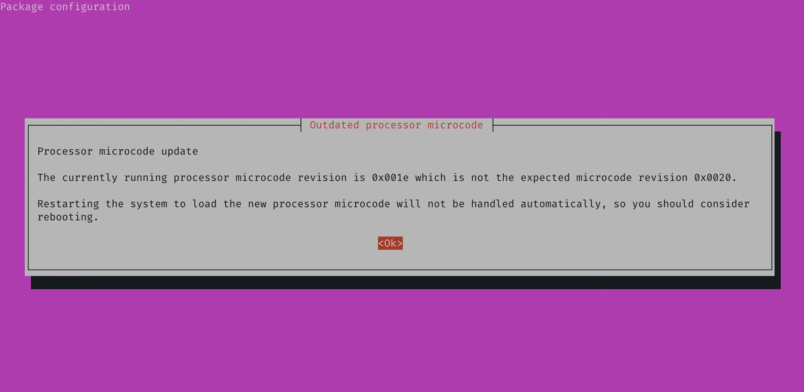
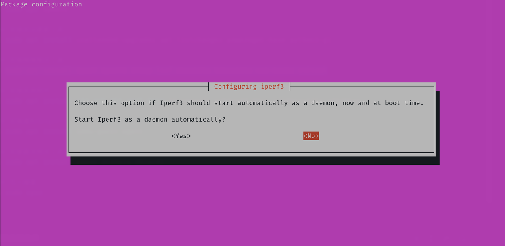
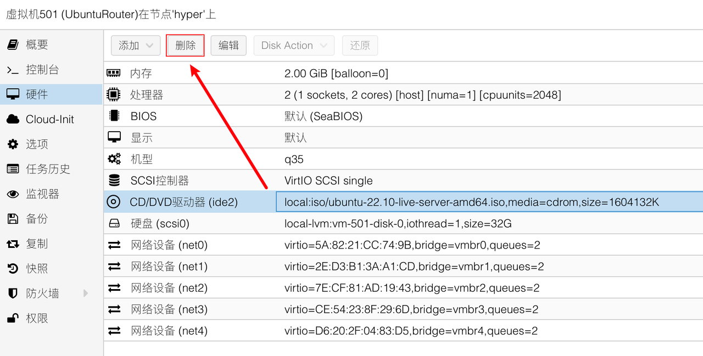
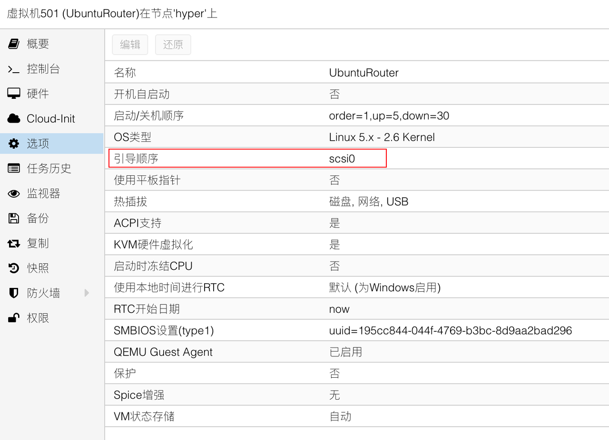
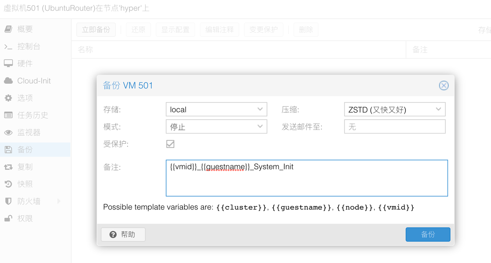

## 1.配置系统软件源

在上一篇文章[《1.Ubuntu服务器安装》](./1.Ubuntu服务器安装.md)中，已经安装好了 Ubuntu Server，并获取了其 IPv4 地址。  

使用 SSH 工具登录 Ubuntu Server，常用 SSH 工具可以看之前文章中的 [SSH 工具推荐](https://gitee.com/callmer/pve_toss_notes/blob/master/1.PVE系统安装.md#03ssh工具) 。  

由于之前设置的 `Mirror address` 仅为临时使用地址，现在需要将其修改为完整版本，依然使用 USTC 镜像站作为演示。  

以后当系统版本发生变化时，请参考使用 snullp 大叔开发的 [配置生成器](https://mirrors.ustc.edu.cn/repogen/) 。  

如果在系统安装时，选择的安装模式为 `Ubuntu Server (minimized)` ，则在修改系统软件源之前，务必安装以下软件包：

```bash
## 系统必要软件包
sudo apt install nano vim bash-completion
```

开始修改系统软件源，逐条执行以下命令：

```bash
## 进入系统源配置文件目录
cd /etc/apt/

## 移除旧的系统源配置文件
sudo rm -rvf sources.list sources.list.curtin.old

## 创建新的系统源配置文件
sudo nano sources.list
```

在 `nano` 编辑器对话框中输入以下内容（注释了 `deb-src` 以便加快软件源同步速度），并保存：

```bash
deb https://mirrors.ustc.edu.cn/ubuntu/ kinetic main restricted universe multiverse
# deb-src https://mirrors.ustc.edu.cn/ubuntu/ kinetic main restricted universe multiverse

deb https://mirrors.ustc.edu.cn/ubuntu/ kinetic-security main restricted universe multiverse
# deb-src https://mirrors.ustc.edu.cn/ubuntu/ kinetic-security main restricted universe multiverse

deb https://mirrors.ustc.edu.cn/ubuntu/ kinetic-updates main restricted universe multiverse
# deb-src https://mirrors.ustc.edu.cn/ubuntu/ kinetic-updates main restricted universe multiverse

deb https://mirrors.ustc.edu.cn/ubuntu/ kinetic-backports main restricted universe multiverse
# deb-src https://mirrors.ustc.edu.cn/ubuntu/ kinetic-backports main restricted universe multiverse

## Not recommended
# deb https://mirrors.ustc.edu.cn/ubuntu/ kinetic-proposed main restricted universe multiverse
# deb-src https://mirrors.ustc.edu.cn/ubuntu/ kinetic-proposed main restricted universe multiverse
```

同步软件源信息，并更新系统，逐条执行以下命令：

```bash
## 清理不必要的包
sudo apt clean && sudo apt autoclean && sudo apt autoremove --purge

## 更新软件源
sudo apt update

## 更新系统
sudo apt upgrade
```

接下来安装配置 Ubuntu Server 所需要的软件，逐条执行以下命令：

```bash
## 安装系统自动更新工具
sudo apt install unattended-upgrades apt-listchanges powermgmt-base python3-gi

## 安装网络相关工具
sudo apt install iperf iperf3 iftop lsof ldnsutils ethtool iputils-ping

## 安装系统软件
sudo apt install nano vim zsh git curl htop lm-sensors smartmontools sshguard tmux cron

## 安装路由相关工具
sudo apt install pppoe nftables dnsmasq

## 更新 PCI 数据库
sudo update-pciids

## 写入磁盘
sudo sync

```

安装 PVE 环境下的 `Qemu Agent` ：

```bash
## 安装 Qemu Agent
sudo apt install qemu-guest-agent
```  

注意，如果 Ubuntu Server 直接安装在 **物理设备** 上，可考虑安装以下软件。

```bash
## 安装 CPU 调度器调整工具
sudo apt install cpufrequtils

## 安装 Intel CPU 微码工具
sudo apt install intel-microcode

## 或安装 AMD CPU 微码工具
sudo apt install amd64-microcode
```

在软件安装过程中，系统可能会提示如下信息：  



表示系统识别到当前 CPU 的微码存在新的版本。  

但在 PVE 环境下 Ubuntu Server 无法加载最新的 CPU 微码，因此可忽略这个警告。  

如果遇到询问是否将 `iperf3` 作为系统服务项自动启动，一般选择 `No` 即可：  



## 2.调整虚拟机硬件参数

经过以上步骤，Ubuntu Server 所需的软件已经安装完成，可以将虚拟机关闭，使用以下命令。

```bash
## 关闭 Ubuntu Server
sudo poweroff
```

回到 PVE 的管理页面，将 Ubuntu Server 所使用的光驱设备移除。



再检查系统引导项，确保只有 `scsi0` 作为引导项。  



## 3.备份虚拟机

由于后续对 Ubuntu Server 的配置较多，建议分阶段对虚拟机进行备份操作。  

这样在意外配置错误或虚拟机异常等情况下，能快速将虚拟机回滚到正常状态。  



至此，Ubuntu Server 系统初始化步骤完成。